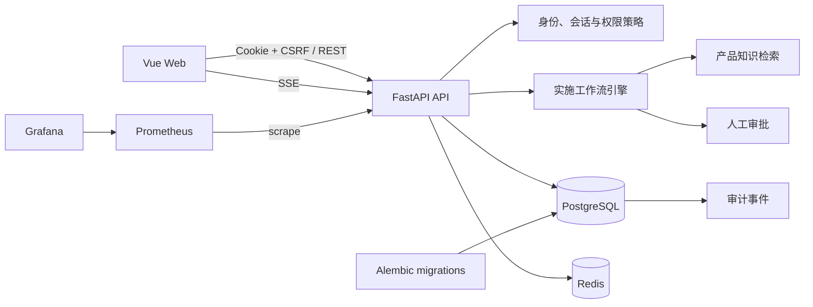
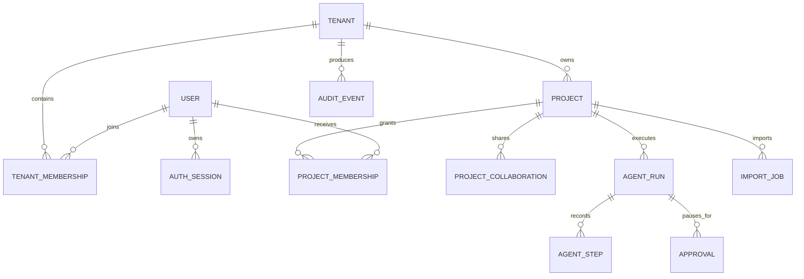
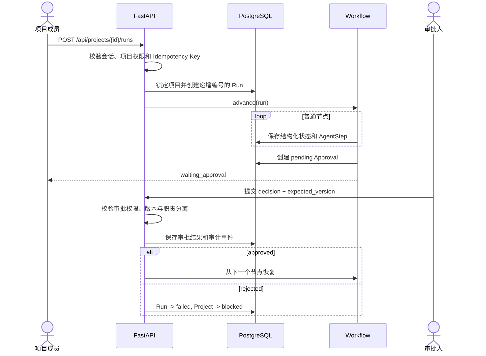

# SaaS Implementation Agent

本地一键启动（Windows）：在项目根目录执行 ` .\start.ps1 `，然后打开 <http://127.0.0.1:8000>。脚本自动使用项目 `.venv`、按需构建前端、备份并迁移本地 SQLite 数据库；无需 npm，也无需单独运行前端。已有服务请先按 Ctrl+C 停止。接口文档仍在 <http://127.0.0.1:8000/docs>。此脚本用于已安装项目依赖的本机开发环境，服务器数据库使用下方部署流程。

开放注册：所有用户可使用账号和密码自行注册，立即使用个人空间，在个人主页绑定邮箱、填写手机号；验证邮箱后可创建公司。手机号暂不验证，不用于登录或找回密码。公司管理员可批量导入成员并发送激活链接；每个账号最多加入一家企业。使用流程、重复核验规则及迁移步骤见 [开放注册说明](OPEN_REGISTRATION.md)。

2026-09-05 实施更新：已接入真实持久化的模拟 SaaS 配置/成员、材料绑定审批、交付物、异步执行适配与知识管理。当前测试、实现边界及未完成事项见 [全流程实施记录](docs/DELIVERY_IMPLEMENTATION.md)，隔离部署见 [预生产运行手册](docs/PREPRODUCTION_RUNBOOK.md)。本地测试通过不代表预生产和真实模型已验收。

一个面向企业 SaaS 上线实施场景的多租户协作平台。项目将需求收集、产品知识检索、差距分析、实施计划、配置变更、数据导入、培训和上线验收组织为可恢复、可审计的工作流，并在计划、配置、导入和验收等高风险节点引入人工审批。

当前仓库是一套可运行的参考实现：后端使用确定性规则和内置知识语料执行 Agent 节点，因此无需外部模型即可启动、测试和演示。生产环境可在保留结构化状态、权限校验和审批边界的前提下，将节点替换为真实模型、向量检索、邮件服务和异步任务系统。

## 核心能力

- 多租户隔离：用户、项目、Run、审批、导入任务和审计事件均带有企业租户边界。
- 平台端与客户公司端分离：平台人员账号和客户账号使用不同登录入口、会话上下文与权限体系。
- 数据库驱动权限：平台角色、公司身份、项目主角色和临时能力共同决定访问权限。
- 可恢复实施流程：每个工作流节点及其结构化状态写入数据库，可在人工审批后继续执行。
- 四类人工审批：实施计划、配置变更、数据导入和上线验收均可暂停并等待决策。
- 职责分离：高风险操作的发起人不能审批自己的请求。
- 审批并发控制：审批请求带版本号，过期页面提交会返回冲突，避免覆盖最新决定。
- 幂等写操作：关键业务写接口要求 `Idempotency-Key`，重复请求可返回首次执行结果。
- 可审计操作：项目、审批、配置、导入、权限和管理操作形成审计事件。
- 安全删除：项目先进入回收站，在保留期结束后再由清理任务物理删除。
- 实时进度：执行详情通过 Server-Sent Events（SSE）接收 Run 状态变化。
- 可观测性基础：提供健康检查、Prometheus 指标入口、请求 ID 和 Trace ID。

## 技术栈

| 层级 | 技术 |
|---|---|
| Web | Vue 3、TypeScript、Pinia、Vue Router、Vite |
| API | FastAPI、Pydantic、SQLAlchemy Async、Uvicorn |
| 数据库 | PostgreSQL 16、pgvector 镜像、Alembic；开发模式也支持 SQLite |
| 缓存与限流 | Redis |
| 安全 | Argon2id、数据库会话、HttpOnly Cookie、CSRF 双提交校验 |
| 运维 | Docker Compose、Nginx、Prometheus、Grafana |
| 测试与质量 | pytest、pytest-asyncio、Ruff、mypy、vue-tsc |

## 系统架构



### 分层职责

1. `web/` 负责客户工作台、公司设置、平台后台、认证页面和执行详情。
2. `backend/main.py` 组装 FastAPI 应用、中间件、核心项目 API、Run、审批、导入和 SSE。
3. 各路由模块分别处理认证、公司治理、平台治理、项目授权和支持访问，避免平台权限与客户权限混用。
4. `backend/permissions.py` 从数据库角色目录计算权限，并统一执行租户、项目、职责分离和防枚举检查。
5. `backend/workflow.py` 按节点推进实施流程，在审批节点持久化状态并主动暂停。
6. SQLAlchemy 模型负责领域数据持久化；Alembic 负责生产数据库结构与权限目录迁移。
7. PostgreSQL RLS 为核心项目数据提供第二层租户隔离；应用层仍会在查询和写入前执行权限校验。

## 目录结构

```text
.
├─ backend/
│  ├─ main.py                    # FastAPI 入口、项目、Run、审批、导入和 SSE
│  ├─ auth_routes.py             # 登录、退出、邀请和密码重置
│  ├─ admin_routes.py            # 公司成员、项目回收站、审计和导出
│  ├─ platform_routes.py         # 平台公司、客户用户和平台人员治理
│  ├─ project_access_routes.py   # 项目成员、协作公司和临时能力
│  ├─ support_routes.py          # 限时只读支持访问申请与审批
│  ├─ permissions.py             # 数据库驱动权限策略
│  ├─ security.py                # 密码、Cookie 会话、CSRF 相关依赖
│  ├─ workflow.py                # 17 节点实施工作流
│  ├─ state_machine.py           # Project 与 Run 状态转换约束
│  ├─ rag.py                     # 可替换的确定性知识检索实现
│  ├─ imports.py                 # CSV 映射、校验与逐行错误
│  ├─ evaluation.py              # 工作流与检索评估入口
│  ├─ cleanup.py                 # 过期软删除项目清理任务
│  ├─ models.py                  # SQLAlchemy 数据模型
│  └─ schemas.py                 # API 与工作流 Pydantic 模型
├─ web/
│  ├─ src/views/                 # 客户端、公司端、平台端页面
│  ├─ src/api.ts                 # API 客户端与 CSRF/幂等请求封装
│  ├─ src/auth.ts                # 前端认证状态
│  └─ src/router.ts              # 页面路由和身份边界
├─ alembic/                      # 数据库迁移
├─ tests/                        # API、权限、租户隔离、工作流与检索测试
├─ evaluations/                  # 确定性评估用例
├─ knowledge/                    # 知识检索扩展说明
├─ skills/                       # 项目文书 Skill 定义及结构化模板
├─ ops/                          # Prometheus、备份和恢复脚本
├─ Dockerfile                    # API 镜像
└─ docker-compose.yml            # API、Web、PostgreSQL、Redis 与监控服务
```

## 领域模型与权限边界

### 身份层级

权限不是单一角色字符串，而是由四层信息共同计算：

| 层级 | 作用 | 典型值 |
|---|---|---|
| 账号类型 | 隔离平台账号与客户账号 | `platform`、`customer` |
| 平台角色 | 控制平台治理能力 | `platform_super_admin`、`platform_operator`、`platform_support`、`platform_auditor` |
| 公司身份 | 控制公司级管理能力 | `company_admin`、`company_member` |
| 项目角色 | 控制单个项目中的业务能力 | `project_manager`、`implementation_consultant`、`approver`、`customer_contact`、`viewer` |

每个项目成员只有一个主项目角色。需要临时补充能力时，可创建带原因、授予人和有效期的能力授权；审批、删除、成员管理、协作管理和平台治理等敏感能力不应通过临时授权绕过。

平台支持访问采用独立授权模型：访问必须限定公司、项目、原因、只读权限和到期时间，并由目标公司管理员审批。平台会话不能直接调用客户业务写接口。

### 核心实体关系



所有对项目子资源的访问都会先解析当前会话，再检查租户或协作关系、项目成员关系和具体权限。对不属于当前访问范围的资源通常返回 `404`，降低通过资源 ID 枚举其他租户数据的风险。

## 实施工作流

一次 Run 包含 17 个按顺序执行的节点：

| # | 节点 | 主要产物或动作 | 是否暂停审批 |
|---:|---|---|---|
| 1 | `create_project` | 建立项目执行上下文 | 否 |
| 2 | `collect_requirements` | 将原始描述转换为结构化需求 | 否 |
| 3 | `retrieve_product_knowledge` | 检索产品能力、SOP 和案例证据 | 否 |
| 4 | `gap_analysis` | 标记已支持能力与需人工确认的差距 | 否 |
| 5 | `generate_implementation_plan` | 生成里程碑、依赖、假设和风险 | 否 |
| 6 | `plan_approval` | 提交实施计划审批 | 是 |
| 7 | `inspect_tenant_configuration` | 读取目标工作区的当前配置 | 否 |
| 8 | `generate_configuration_changes` | 生成带风险级别和原因的配置差异 | 否 |
| 9 | `configuration_approval` | 提交配置变更审批 | 是 |
| 10 | `apply_configuration` | 应用配置并记录快照与审计 | 否 |
| 11 | `validate_import_files` | 校验导入文件和映射 | 否 |
| 12 | `import_approval` | 提交数据导入审批 | 是 |
| 13 | `execute_import` | 执行已审批的导入任务 | 否 |
| 14 | `generate_training_materials` | 生成管理员、成员和 FAQ 材料清单 | 否 |
| 15 | `run_go_live_checks` | 执行上线前检查并生成验收报告 | 否 |
| 16 | `acceptance_approval` | 提交上线验收审批 | 是 |
| 17 | `close_project` | 完成 Run 并关闭实施项目 | 否 |

### Run 执行过程



Run 和 Project 各自拥有独立状态机：

- Project：`draft → ready/in_progress → blocked/completed/cancelled → archived`
- Run：`pending → running → waiting_approval → running → succeeded/failed/cancelled`
- 拒绝审批会使当前 Run 失败，并把项目置为 `blocked`。
- 取消活动 Run 会同时取消待处理审批，并把项目置为可重试的阻塞状态。
- 重试会创建新的 Run 编号，并通过 `retry_of_run_id` 保留与失败或取消 Run 的关系。
- 每个节点写入有序的 `AgentStep`，Run 的结构化状态保存需求、差距、计划、配置变更、审批和验收结果。

## 关键请求流程

### 登录与写请求

1. 客户入口使用账号和密码登录，兼容原邮箱登录；平台入口继续使用平台邮箱和密码。
2. 后端验证 Argon2id 密码哈希、账号类型、账号状态和登录限流。
3. 后端创建数据库会话，仅把随机会话令牌的哈希写入数据库。
4. 浏览器收到 HttpOnly 会话 Cookie 和可读取的 CSRF Cookie。
5. 业务写请求同时携带 CSRF 请求头；关键操作还需要唯一的 `Idempotency-Key`。
6. 后端解析 Principal，计算公司、平台或项目权限，完成操作后写入审计事件。

密码重置成功后会撤销该用户的旧会话。邀请和密码重置令牌也只以哈希形式持久化，明文令牌仅在创建时用于生成一次性链接。

### CSV 导入

1. 调用 `/api/imports/validate` 提交项目 ID 和 CSV 内容。
2. 后端校验字段映射、必填列、邮箱格式和重复项，返回逐行错误。
3. 校验结果和源文件摘要保存为 `ImportJob`。
4. 导入进入人工审批节点。
5. `/api/imports/{job_id}/execute` 只接受属于同一项目且状态为 `approved` 的导入审批。
6. 执行结果与审计事件持久化，重复幂等请求不会再次导入。

### 项目协作

1. 项目归属公司邀请另一家公司参与指定项目。
2. 受邀公司的管理员接受或拒绝协作邀请。
3. 接受后，该公司的用户仍需项目成员关系与项目角色才能执行业务动作。
4. 撤销协作后访问立即失效，历史成员关系、协作记录和审计事件继续保留。

## API 概览

| 分组 | 前缀或端点 | 用途 |
|---|---|---|
| 健康与指标 | `/health`、`/metrics` | 存活检查与 Prometheus 指标 |
| 认证 | `/api/auth` | 客户/平台登录、退出、当前用户、邀请、密码重置 |
| 项目 | `/api/projects` | 创建、查询、软删除、计划与验收报告 |
| Run | `/api/projects/{id}/runs`、`/api/runs` | 启动、重试、取消、步骤和 SSE 事件 |
| 审批 | `/api/approvals` | 查询审批并提交带版本号的决策 |
| 导入 | `/api/imports` | CSV 校验与已审批导入执行 |
| 项目授权 | `/api/projects/{id}/members` | 项目成员、主角色和临时能力 |
| 公司协作 | `/api/projects/{id}/collaborating-companies` | 公司邀请、确认、拒绝与撤销 |
| 公司治理 | `/api/company` | 成员、邀请、项目回收站、审计、导出与支持访问审批 |
| 平台治理 | `/api/platform` | 公司、客户用户、平台人员、全局审计与只读检查 |

服务启动后，可通过 `/docs` 查看由 FastAPI 自动生成的 OpenAPI 交互文档。

## 快速启动

### Docker Compose

要求安装 Docker Engine 与 Docker Compose v2。

```bash
cp .env.example .env
docker compose up --build
```

启动前应修改 `.env` 中的数据库密码和引导管理员密码。Compose 会启动：

| 服务 | 默认地址 |
|---|---|
| Web | <http://localhost:8080> |
| API / OpenAPI | <http://localhost:8000> / <http://localhost:8000/docs> |
| PostgreSQL | `localhost:5433` |
| Redis | `localhost:6379` |
| Prometheus | <http://localhost:9090> |
| Grafana | <http://localhost:3000> |

API 容器启动顺序为：确保最小权限应用数据库角色存在 → 使用迁移账号执行 Alembic → 授予应用账号 DML 权限 → 启动 Uvicorn。

> `docker-compose.yml` 面向开发与功能验证。公开部署前必须启用 HTTPS、安全 Cookie、独立密钥管理、受限网络、正式邮件服务、持久化备份和生产级可观测性，且不能继续使用示例密码。

### 后端开发

要求 Python 3.11 或更高版本。

```bash
python -m venv .venv
source .venv/bin/activate
python -m pip install -e ".[dev]"
cp .env.example .env
alembic upgrade head
uvicorn backend.main:app --reload
```

Windows PowerShell 激活虚拟环境时使用：

```powershell
.venv\Scripts\Activate.ps1
```

默认配置可使用 SQLite 运行后端；完整的数据库角色、迁移和 RLS 行为应在 PostgreSQL 中验证。Redis 不可用时限流器会降级为进程内实现，该模式不适合多实例部署。

### 前端开发

要求 Node.js 22 或兼容版本。

```bash
cd web
npm install
npm run dev
```

Vite 开发服务器会把 `/api` 和 `/health` 代理到后端服务。

## 环境变量

`.env.example` 只包含可公开的变量名称和示例值。真实 `.env`、密钥、令牌、数据库文件和备份均不应提交到版本库。

| 变量 | 用途 |
|---|---|
| `DATABASE_URL` | API 使用的 SQLAlchemy 异步数据库连接 |
| `MIGRATION_DATABASE_URL` | Alembic 和数据库角色管理使用的高权限连接 |
| `POSTGRES_USER` / `SAAS_DB_PASSWORD` | Compose 中的 PostgreSQL 管理账号 |
| `APP_DB_USER` / `SAAS_APP_DB_PASSWORD` | API 最小权限数据库账号 |
| `POSTGRES_DB` | PostgreSQL 数据库名称 |
| `REDIS_URL` | Redis 限流连接 |
| `AUTO_CREATE_SCHEMA` | 是否由 SQLAlchemy 自动建表；生产应为 `false` |
| `COOKIE_SECURE` | 是否只通过 HTTPS 发送认证 Cookie；生产应为 `true` |
| `CORS_ORIGINS` | 允许携带凭据访问 API 的前端来源列表 |
| `SESSION_HOURS` | 数据库登录会话有效期 |
| `BOOTSTRAP_ADMIN_EMAIL` | 首次引导的平台管理员邮箱 |
| `BOOTSTRAP_ADMIN_PASSWORD` | 首次引导的平台管理员密码 |
| `BOOTSTRAP_ADMIN_NAME` | 首次引导的平台管理员显示名称 |
| `FRONTEND_BASE_URL` | 邀请与密码重置链接的前端基地址 |
| `MAIL_DEBUG` | 是否返回调试预览链接；生产应为 `false` |
| `OPENAI_API_KEY` | 替换为真实模型节点时使用，当前确定性流程不依赖 |
| `LANGFUSE_PUBLIC_KEY` / `LANGFUSE_SECRET_KEY` | 可选 Agent 可观测性集成 |
| `OTEL_EXPORTER_OTLP_ENDPOINT` | 可选 OpenTelemetry 导出端点 |

## 数据库迁移与数据治理

- 使用 Alembic 管理数据库结构，不应在生产环境依赖 `Base.metadata.create_all()` 改表。
- API 账号应与迁移账号分离；API 账号不需要建库、建角色、DDL 或 `BYPASSRLS` 权限。
- 项目及 Run、步骤、审批、导入等核心子表在 PostgreSQL 中启用 RLS，应用层权限校验仍是第一道边界。
- 幂等记录使用租户、操作范围和幂等键组合去重。
- 项目默认软删除并保留 30 天；生产调度器应每日调用 `backend.cleanup.purge_expired_projects`。
- `ops/backup.sh` 创建 PostgreSQL custom-format 备份并按保留期清理；`ops/restore.sh` 用于恢复后执行迁移。
- 备份文件必须写入版本库之外的受控存储，并定期在隔离环境执行恢复演练。

## 测试与质量检查

后端：

```bash
pytest -q
ruff check backend tests
mypy backend
```

前端：

```bash
cd web
npm run typecheck
npm run build
```

测试重点包括认证与邀请、会话撤销、跨租户隔离、平台/客户账号边界、项目角色、临时能力、协作公司、软删除、状态机、审批并发、CSV 导入和知识检索。

## 当前实现边界

- 工作流节点目前使用确定性逻辑，适合离线演示和稳定测试，不等同于已经接入通用大模型。
- 知识库当前内嵌在 `backend/rag.py`；生产可替换为 PostgreSQL 全文检索与 pgvector，同时保持 `search()` 的返回契约。
- 邮件支持事务入队和 SMTP；调试模式仅返回预览链接，不向日志写入一次性令牌。
- Celery/Outbox/LangGraph、S3 与基础告警已有适配和预生产配置；真实依赖的故障验收尚未完成。企业 OIDC/SSO、PITR 和完整告警通知仍需补充。
- 管理后台不提供任意 SQL 或底层表编辑能力，以避免绕过授权与审计。

## 参与贡献

欢迎通过 Issue 描述问题、复现步骤和预期行为，通过 Pull Request 提交改进。提交前请确保后端测试、Ruff、前端类型检查和生产构建均通过，并避免在测试数据、日志、截图或提交历史中包含真实客户信息、密钥或内部文档。
